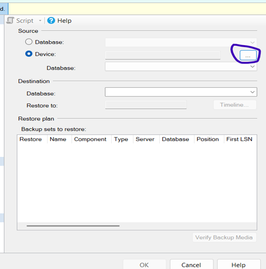

# T1Bases2

### Pasos para instalar SQL SERVER 2022 en Ubuntu desde Windows:
1.	Lo primero es actualizar los paquetes generales para que no existan problemas por librerías desactualizadas.
 

2.	Con este comando confirmamos las actualizaciones pendientes.

3.	Esto es la llave oficial de Microsoft para que el sistema pueda verificar los paquetes correctamente.
 

5.	Con esto le decimos al sistema que si necesita buscar paquetes de SQl lo haga desde la página oficial de Microsoft.
 

 
6.	Aquí le estamos diciendo que queremos instala SQL SERVER.

6.	Aquí configuramos nuestro entorno de SQL SERVER.

7.	Para el caso de la tarea lo mejor es utilizar la opción de Developer, ya que es una licencia para crear bases de manera gratuita.
 

8.	Esto queda a elección personal, pero en general es el lenguaje en el que se mostrara SQL SERVER
 
 

9.	Aquí nos va a pedir crear una contraseña para ser los administradores del sistema esta debe tener mayúsculas, minúsculas y números, además un tamaño de 8
caracteres.

10.	Estos son paquetes de Debian para poder instalar la librería que necesita SQL SERVER.

11.	Aquí instalamos la librería directamente después del paquete.

12 Reiniciamos el sistema de SQL SERVER.

13.	Podemos establecer una contraseña para el usuario sa pero para esto se debe parar la maquina con el comando sudo systemctl stop mssql-server.
 

14.	Una vez establecida la contraseña solo escrbimos lo siguiente: sudo systemctl start mssql-server y para ver si se inició correctamente sudo systemctl status
mssql-server.

 
15.	Si el usuario decide puede utilizar una herramienta como el management studio, pero para configurarlo bien nos devolvemos a Ubuntu y escribimos el comando en pantalla, ahí podremos ver la IP, la cual es la que esta resaltada, la idea es que cada uno revise su ip y pruebe a escribirla luego en management studio.

    

16.	Escribimos la IP en server name el usuario sa que fue el que configuramos y luego su respectiva contraseña.

 
17.	Si se realizaron correctamente los pasos debería aparecernos de la siguiente manera.

### Guía para instalar Node.js
1.	Copiamos el enlace de donde vamos a descargar node

2.	Le decimos que queremos instalar nodejs

3.	Observamos la versión que se nos instalo

 
4.	Creamos una carpeta con el nombre que se prefiera y entramos a la carpeta

5.	Realizamos la iniciación del proyecto para nodejs

6.	Creamos un archivo inicial.

7.	Instalamos express para la creación de la API

 
### Para instalar la base en managament studio:
1.	Utilizamos el siguiente enlace: AdventureWorks Sample Databases - SQL Server | Microsoft Learn
2.	Se presiona la siguiente opción una vez.
   
3.	Una vez descarga la pasamos a nuestro disco duro C
4.	Abrimos management studio y nos logueamos
5.	Click derecho sobre Databases y presionamos con click izquierdo restore Database

   
 

6.	Y se abre la siguiente ventana donde presionamos en Device y luego los tres puntos
 
 

 
7.	Aquí presionamos con click izquierdo la primera carpeta de todas y luego en las carpetas del lado derecho presionamos igual con click izquierdo la que dice mnt

 
8.	Así debe aparecer y luego presionamos c

   
9.	Aquí ya debería aparecernos la descarga que habíamos movido anteriormente.
 

 
10.	La presionamos y aceptamos todo lo anterior, una vez este todo aceptado debe salir

11.	Y la deberíamos poder observar en los snapshots
 

